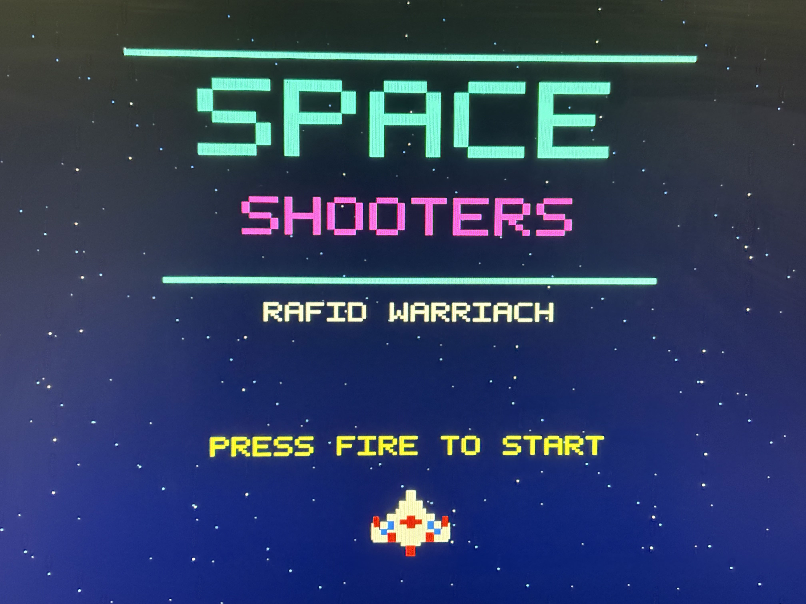
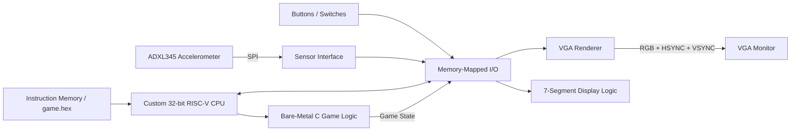

# Space Shooters
### Custom RISC-V CPU + FPGA Arcade System

**Space Shooters** is a retro arcade game built on a **Terasic DE10-Lite FPGA** around a custom **32-bit RISC-V processor written in Verilog**.

The project combines computer architecture, digital logic, embedded C, memory-mapped I/O, SPI sensor interfacing, and VGA graphics into a complete hardware/software system running on the FPGA.

> **Source code is maintained in a private repository.**
> This public repository is a project showcase containing media, architecture details, and a technical overview.

---

## Demo

### Title Screen



### Gameplay

[▶ Watch the gameplay demo](media/gameplay-demo.mp4)

The fighter is controlled by physically tilting the DE10-Lite board using its onboard ADXL345 accelerometer.

---

## System Highlights

- Custom **32-bit RISC-V CPU** implemented in Verilog
- Bare-metal **C game logic** compiled with the GNU RISC-V toolchain
- **Memory-mapped I/O (MMIO)** between software and FPGA peripherals
- **ADXL345 accelerometer** interfaced over SPI
- Custom **640×480 VGA** graphics engine
- Real-time player movement, shooting, collision detection, scoring, lives, and high score
- Five animated meteor obstacles
- Combo multiplier and increasing difficulty
- Procedural multi-layer starfield
- **Overdrive** power-up with a transformed fighter and triple-shot fire
- Physical seven-segment display integration
- Complete hardware/software co-design on the DE10-Lite

---

## Controls

| Input | Function |
|---|---|
| Tilt DE10-Lite | Move fighter |
| `KEY1` | Fire / Start / Restart |
| `KEY0` | Activate Overdrive |
| `SW0` | System reset |

---

## Architecture



The FPGA contains the processor and peripherals as hardware operating in parallel. The C program runs on the custom CPU and controls game state through MMIO, while dedicated FPGA logic continuously handles VGA rendering and sensor communication.

---

## Hardware / Software Split

### Verilog Hardware
- Program counter
- Register file
- ALU
- Instruction decoder and control logic
- Immediate generator
- Instruction and data memory interfaces
- MMIO subsystem
- SPI accelerometer interface
- VGA timing and pixel renderer
- Seven-segment display logic
- Clock and reset logic

### Bare-Metal C Software
- Player movement
- Shooting logic
- Meteor movement and respawning
- Collision detection
- Score and lives
- Difficulty levels
- Combo multiplier
- Respawn behavior
- Overdrive state and timing
- Game-state transitions

---

## C to Custom CPU Flow

```text
main.c
   ↓
GNU RISC-V GCC
   ↓
RV32I machine instructions
   ↓
game.hex
   ↓
FPGA instruction memory
   ↓
Custom RISC-V CPU
   ↓
MMIO
   ↓
Accelerometer / VGA / Controls / Displays
```

The game software is compiled using the GNU RISC-V embedded toolchain for a 32-bit integer RISC-V target. The resulting machine instructions are loaded into FPGA instruction memory and executed directly by the custom processor.

---

## Technology

**HDL:** Verilog, VHDL  
**Software:** C, RISC-V Assembly  
**Hardware:** Terasic DE10-Lite, Intel MAX 10 FPGA, ADXL345  
**Interfaces:** SPI, MMIO, VGA  
**Tools:** Quartus Prime, GNU RISC-V Toolchain, Git

---

## Author

**Rafid Warriach**  
Computer Engineering
